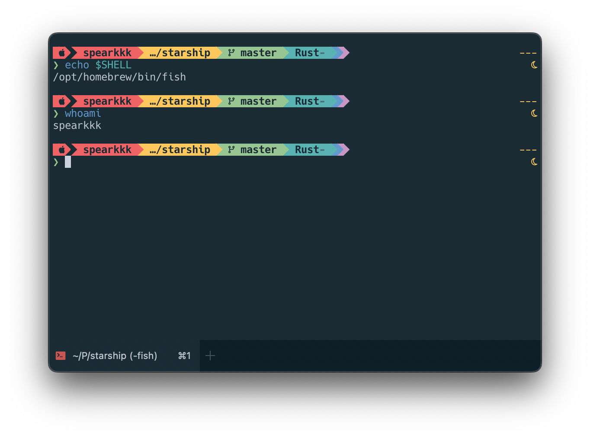

<h3 align="center">
	<br/>
	
	Oceanic Next Color Theme for <a href="https://starship.rs">Starship</a>
</h3>
<p align="center">
	<a href="https://github.com/spearkkk/starship-oceanic-next/stargazers"></a>
	<a href="https://github.com/spearkkk/starship-oceanic-next/contributors"></a>
</p>

<h3 align="center">
Theme with Oceanic Next Color for Starrrrrrrrship 🎨 <br/>
</h3>



### How to Get This Nice Theme to My Machine?
```shell
   mkdir -p ~/.config && curl -o ~/.config/starship.toml \
   https://raw.githubusercontent.com/spearkkk/starship-oceanic-next/main/starship.toml
```
Please back-up your `starship.toml` file before applying

### Thanks 🫰🏼

The theme is heavily inspired by the following works:

- [oceanic next color theme](https://github.com/voronianski/oceanic-next-color-scheme)
- [starship-gruvbox-rainbow](https://github.com/fang2hou/starship-gruvbox-rainbow)

### License

[MIT](LICENSE)


